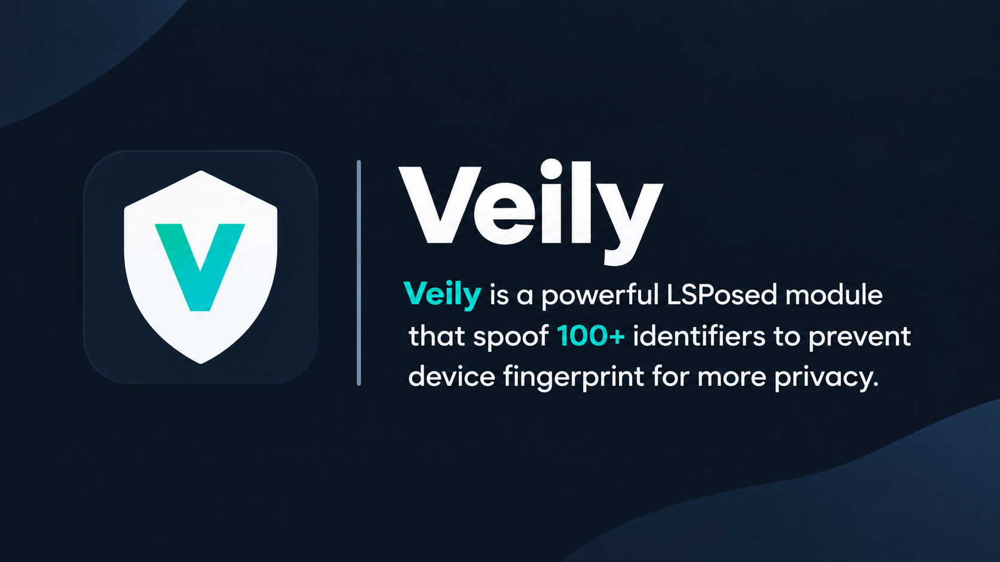

# Veily — Advanced Device Environment & Privacy Manager

**Professional-grade device environment & privacy manager for rooted Android**

Veily is built on the **Xposed / LSPosed** framework and gives you precise **per-app control** over device hardware, system, telephony, network, and regional identifiers.

---

## 🛠 Device & System Hooks

- Android ID
- App Set ID
- Advertising ID
- GSF ID
- Media DRM ID
- Boot ID
- Anonymous App ID (AAID)
- Device Model
- Manufacturer & Brand
- OS Version
- Build Information
- Build Fingerprint
- Hardware / Board / Display Information
- Hardware Serial
- Developer Options / Developer State

---

## 📱 Telephony & SIM Hooks

- IMEI, IMSI, MEID
- SIM Serial (ICCID)
- Subscriber ID
- Phone Number
- Voicemail Number
- SIM Country & Operator
- MCC / MNC
- Carrier Network
- Country ISO / Region
- International Dialing Code

---

## 📶 Wi-Fi & Connectivity

- Wi-Fi MAC Address
- BSSID & SSID
- Bluetooth MAC Address
- Carrier & Network Information

---

## 🌍 Country Profiles

Apply a complete regional environment with one profile:

- Country & Region
- Timezone
- Currency & Symbol
- Locale & Language
- Date Format
- SIM Country
- MCC / MNC
- International Dialing Code
- Country-specific settings

---

## 📍 Location

- Custom Latitude & Longitude
- Region-based location configuration
- Interactive map with pan & zoom
- Individual or App Group support

---

## 🔄 Multi-Profile System

Create multiple independent profiles for each app, each with its own device environment, country, location, hooks, and rules.

**Switch between profiles instantly.**

---

## 📦 App Groups & Batch Management

Apply to multiple applications in one tap:

- Device Profiles
- Country Profiles
- GPS Coordinates
- Configuration Rules

Groups can be exported and restored as a single **`.veily`** archive.

---

## 💾 Backup & Restore

A `.veily` backup can include:

- Device Profile
- App Data
- Internal CE Data
- Device-Protected (DE) Storage
- `/sdcard/Android/data`
- Runtime Permissions

Additional tools:

- Force Stop
- Clear App Data

---

## 🛡 Anti-Fingerprinting

Veily helps prevent **device fingerprinting** by spoofing **50+ device and environment signals** used by applications to build a unique device fingerprint.

All spoofed values remain internally consistent across related hardware, system, and build properties to minimize cross-signal mismatches.

---

## 🔒 Privacy & Detection Controls

- Xposed Concealment
- Hide Root Detection
- Hide Developer Options
- Installation Source Spoofing (Reports Google Play Store)

---

## 📚 Device Presets

**800+ authentic device presets** with genuine specifications, hardware information, board details, display properties, and certified build fingerprints.

---

## 🎲 Randomization Engine

Generate realistic randomized device environments while maintaining cross-property consistency across related properties.

---

## 💽 RAM & Storage Emulation

- Total RAM
- Available RAM
- Total Internal Storage
- Available Internal Storage

---

## ⚙️ Per-App Control

Every target application maintains its own independent:

- Device Environment
- Country Profile
- Location
- Hooks
- Detection Controls
- Backup Configuration
- Profile Settings

---

## 🌑 Interface

Modern dark-themed UI built on the **Cosmic Noir** design system.

---

## 🔐 Privacy & Data

All configurations, profiles, and rules are stored **locally** on your device.

**Veily does not upload, sync, or transmit configuration data to external servers.**

---

# 💎 Access

Veily is a **paid application**. A trial period is available before purchase.

---

# ✅ Requirements

- Rooted Android Device
- Magisk / KernelSU / APatch
- LSPosed

---

# 🚀 Installation

1. Install the Veily APK.
2. Enable Veily inside LSPosed.
3. Add target applications to Veily's LSPosed scope.
4. Configure profiles, hooks, and rules.

---

# 💬 Support

- **Telegram:** @veilysupport
- **Info Bot:** @veilyinfo_bot
- **Channel:** @veily_app

---

# End User License Agreement (EULA)

> **Please read this agreement carefully before installing or using Veily.** By installing, accessing, or using the software, you agree to these terms.

---

## 1. License

Veily is a paid application. A free trial is provided so you can evaluate the software before purchasing.

---

## 2. Payment & Refund Policy

**All purchases are final.**

No refunds will be issued after a license purchase. Please use the trial period to evaluate compatibility before buying.

---

## 3. Intended Use

Veily is developed exclusively for legitimate privacy protection and personal use.

**This software must not be used to:**

- Violate any applicable laws or regulations
- Deceive, defraud, or harm individuals or organizations
- Breach the Terms of Service of any application or platform
- Engage in unauthorized or illegal activities

---

## 4. User Responsibility

The user is solely responsible for how Veily is used. The developer shall not be liable for misuse, damages, or legal consequences arising from the use of this software.

---

## 5. Disclaimer of Warranties

Veily is provided **"AS IS"** and **"AS AVAILABLE"**, without express or implied warranties, including merchantability, fitness for a particular purpose, or non-infringement.

---

## 6. Limitation of Liability

The author and developer shall not be liable for any direct, indirect, incidental, special, or consequential damages resulting from the use or inability to use Veily.
